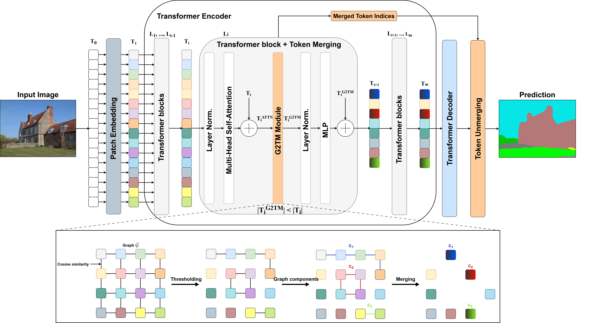

# G2TM: Single-Module Graph-Guided Token Merging for Efficient Semantic Segmentation (VISAPP 2026)


<div align="center" style="background: linear-gradient(135deg, #667eea 0%, #764ba2 100%); padding: 20px; border-radius: 8px; color: white; margin-bottom: 20px; box-shadow: 0 2px 10px rgba(0,0,0,0.1); font-family: -apple-system, BlinkMacSystemFont, 'Segoe UI', Helvetica, Arial, sans-serif;">
  <h2 style="margin: 0; font-weight: 600;"><strong>🚀 Update available</strong></h2>
  <p style="margin: 8px 0 0">
    <strong>G2TM can now be run with PyTorch 2.4.1 and PyTorch Geometric!</strong>
  </p>
  <p style="margin: 8px 0 0">
    The code can be found in the <a href="https://github.com/vbercy/g2tm-segmenter/torch2" style="color: #FFD700; text-decoration: underline;">`torch2` branch</a>
  </p>
  <p style="margin: 8px 0 0; font-size: 0.9em; font-style: italic; line-height: 1.5; opacity: 0.9">
    <em>For optimal results obtained in the paper, we still recommand using the <a href="https://github.com/vbercy/g2tm-segmenter/" style="color: #FFD700; text-decoration: underline;">main branch</a> with the NetworkX library.</em>
  </p>
</div>

<p align="center">
  <br> <strong>Authors:</strong> <a href="https://orcid.org/0009-0006-0682-8927" style="color: #4752C4">Victor BERCY</a>, <a href="https://orcid.org/0000-0002-5102-7735" style="color: #4752C4">Martyna POREBA</a>, <a href="https://orcid.org/0009-0000-9061-4396" style="color: #4752C4">Michal SZCZEPANSKI</a>, <a href="https://orcid.org/0000-0002-2860-8128" style="color: #4752C4">Samia BOUCHAFA</a>
</p>

<p align="center">
  <!-- Versions Python -->
  

  <!-- Version du projet -->
  
  
  <!-- Licence -->
  

  <!-- Vérification du linting -->
  <a href="https://github.com/vbercy/g2tm-segmenter/actions/workflows/pylint.yml">
    
  </a>

  <!-- Conda installation -->
  <a href="https://github.com/vbercy/g2tm-segmenter/actions/workflows/python-package-conda.yml">
    
  </a>
</p>

<p align="center">
  <!-- Article -->
  <a href="https://www.scitepress.org/Link.aspx?doi=10.5220/0014267600004084">
    
  </a>
  <!-- Article -->
  <a href="https://cea.hal.science/cea-05578363">
    
  </a>
  <!-- Repository -->
  <a href="https://github.com/vbercy/g2tm-segmenter">
    
  </a>
</p>

Graph-Guided Token Merging (G2TM) is a lightweight one-shot module designed to eliminate redundant tokens early in the ViT architecture. It performs a single merging step after a shallow attention block, enabling all subsequent layers to operate on a compact token set. It leverages graph theory to identify groups of semantically redundant patches.



## G2TM applied to Segmenter

In this repository, Graph-Guided Token Merging (G2TM) is applied to
[Segmenter: Transformer for Semantic Segmentation](https://arxiv.org/abs/2105.05633)
by Robin Strudel*, Ricardo Garcia*, Ivan Laptev and Cordelia Schmid, ICCV 2021, by extending its code with token merging modules.

## Installation

In this section, we will explain how to set the environment up for this repository (Segmenter + G2TM) step by step. 

**1. Clone the repository:**

``` bash
git clone -b torch2 https://github.com/vbercy/g2tm-segmenter
cd g2tm-segmenter
```

**2. Setting up a conda environment:**

G2TM targets [PyTorch](https://pytorch.org/) 2.4.1 and [PyTorch Geometric](https://pytorch-geometric.readthedocs.io/) 2.7.0.

``` bash
# create environment
conda create -n G2TM python==3.12.3
conda activate G2TM
# install Torch 2 using conda
conda install pytorch==2.4.1 torchvision==0.19.1 torchaudio==2.4.1 pytorch-cuda=12.4 -c pytorch -c nvidia
# install PyG using conda
pip install torch_geometric
pip install pyg_lib torch_scatter torch_sparse torch_cluster torch_spline_conv -f https://data.pyg.org/whl/torch-2.4.1+cu124.html
```

**3. Installing the Segmenter requirements:**

``` bash
# install packaging helpers and the Torch 2-compatible OpenMMLab stack
pip install openmim
# Ignore conflict warning on setuptools~=60.2.0
pip install setuptools==80.8.0
mim install --no-build-isolation 'mmcv<2.2.0'
mim install mmsegmentation
# set up the Segmenter package
pip install -v -e .
```

**4. Installing the G2TM requirements:**

``` bash
# set up the G2TM package
cd g2tm/ && pip install -v -e . && cd ../
```

**5. Prepare the datasets**

If needed, to download and prepare ADE20K, Cityscapes and/or PascalContext dataset(s), use the following command(s):

```bash
python ./segm/scripts/prepare_ade20k.py <ade20k_dir>
python ./segm/scripts/prepare_cityscapes.py <cityscapes_dir>
python ./segm/scripts/prepare_pcontext.py <pcontext_dir>
```

Then, define an OS environment variable pointing to the directory corresponding to the dataset you want to use:

```bash
export DATASET=/path/to/dataset/dir
```

## Training

To train a Segmenter model (size tiny, small, base or large) with G2TM on a specific dataset (whose path is provided by `DATASET`), use the command provided below. In the paper, for example, we chose to apply G2TM at the 2nd layer with a threshold of 0.88 and without any modified attention formulation.

**Note:** a log file and a tensorboard directory will automatically be created for you to monitor your training.

```bash
python ./segm/train.py --log-dir <model_dir> \
                       --dataset <dataset_name> \
                       --backbone vit_<size>_patch16_384 \
                       --decoder mask_transformer \
                       --patch-type graph \
                       --selected-layer 2 \
                       --threshold 0.88 \
                       --batch-size 8
```

We explain here the specific options for G2TM:
- `--patch-type graph`: Applies the G2TM token reduction method.
- `--selected-layer 2`: Specifies which layers of the network to apply G2TM. In this case, the 2nd layer.
- `--threshold 0.88`: Sets the similarity threshold for merging tokens in G2TM.

**All training commands** can be run with or without G2TM using the `patch-type` option, as well as with or without (Inverse) Proportional Attention using the `prop-attn` or `iprop-attn` options.

For more examples of training commands (e.g.: with curriculum, with Inverse Proportional Attention, etc.), see [TRAINING](../TRAINING.md).

## Inference

You can download a checkpoint with its configuration in a common folder, in the [Results and Models](#results-and-models) part.

To perform an evaluation (mIoU) of a Segmenter model with G2TM on the dataset it has been trained on, execute the following command. Make sure that the directory provided for the `model-path` option contains the checkpoint AND the `variant.yaml` file. Here, we choose to evaluate the model with G2TM applied at the 2nd layer with a threshold of 0.88, as it has been trained in the previous part.

**NOTE:** Please use the correct values for the `selected-layer` and `threshold` options for the evaluated model. You can find these values in the `variant.yaml` file.

```bash
python ./segm/test.py <ckpt_file> \
       --patch-type graph \
       --selected-layer 2 \
       --threshold 0.88
```

Note that you can still use the evaluation script (mIoU, mAcc, pAcc) provided by Segmenter using this command:

```bash
# single-scale baseline + G2TM evaluation:
python ./segm/eval/miou.py <ckpt_file> <dataset_name> \
       --singlescale \
       --patch-type graph \
       --selected-layer 2 \
       --threshold 0.88

# Explanation:
# --singlescale: Evaluates the model using a single scale of input images (otherwise --multiscale).
# --patch-type pure: Uses the standard patch processing without any modifications.
```

**All evaluation commands** can be run with or without G2TM using the `patch-type` option, as well as with or without (Inverse) Proportional Attention using the `prop-attn` or `iprop-attn` options.

## Benchmarking

To calculate the throughput and GFLOPs of a model, execute the following commands. Again, ensure that the directory provided for the `model-path` option contains the checkpoint AND the `variant.yaml` file.

**NOTE:** Please use the specific values for the `selected-layer` and `threshold` options for the evaluated model. You can find these values in the `variant.yaml` file.

```bash
# Im/sec
python ./segm/speedtest.py <ckpt_file> <dataset_name> \
       --batch-size 1 \
       --patch-type graph \
       --selected-layer 2 \
       --threshold 0.88
```
```bash
# GFLOPs
python ./segm/flops.py <ckpt_file> <dataset_name> \
       --batch-size 1 \
       --patch-type graph \
       --selected-layer 2 \
       --threshold 0.88
```

To profile model activity during inference on CPU and GPU using PyTorch tools, use the following command:

```bash
python ./segm/profile_model.py <ckpt_file> <dataset_name> \
       --patch-type graph \
       --selected-layer 2 \
       --threshold 0.88
```

**All benchmarking commands** can be run with or without G2TM using the `patch-type` option, as well as with or without (Inverse) Proportional Attention using the `prop-attn` or `iprop-attn` options.

## Token visualization

To visualize segementation maps as well as the tokens and the attention maps at a specified layer for a specific image, execute the following command. It supports visualizations for both models with and without token reduction. For more details on the outputs, see the function documentation. In the example below, we generate visualization for a Segmenter model with G2TM applied at the 2nd layer with a threshold of 0.88.

```bash
python ./segm/show_attn_map.py <ckpt_file> <img_path> \
       <output_dir> <dataset_cmap> \
       --cls --enc --layer-id <layer> \
       --patch-type graph \
       --selected-layer 1
       --threshold 0.95
```

We explain here the specific options for G2TM:
- `--cls`: The attention maps provided are so with respect to the [CLS] token, otherwise (`--patch`) you have to provide the coordinate of the reference patch (`--x-patch <x> --y-patch <y>`).
- `--enc`: Whether the visualization is made in the encoder or in the decoder (`--dec`).
- `--layer-id <layer>`: The index of the layer (starting from 0) for visualization.

To get some statistics on the remaining tokens after merging, please run the following command:

```bash
python ./segm/token_stats.py <ckpt_file> <dataset> \
       --layer-id <layer> \
       --patch-type graph \
       --selected-layer 1
       --threshold 0.95
```

We explain here the specific options for G2TM:
- `--layer-id <layer>`: The index of the layer (starting from 0) where to measure the token statistics (measured after the merging operation if the Transformer block contains a G2TM module).

**All token commands** can be run with or without G2TM using the `patch-type` option, as well as with or without (Inverse) Proportional Attention using the `prop-attn` or `iprop-attn` options.

## Results and Models

See [RESULTS](../RESULTS.md) for some comparative results for Segmenter + G2TM and the corresponding model checkpoints.

**NOTE:** We are still looking for a solution to host all model checkpoints, in the meantime do not hesitate to request the checkpoints by contacting one of the authors.

**WARNING: Results above are given using the NetworkX implementation of G2TM, therefore differences in the throughput scores can occur. We observe that the PyG implementation is slower that the NetworkX one. It may be subject to further optimisations.**

## Upcoming Features 

```
- [x] Training and Inference scripts
- [x] Flops and Speedtest scripts
- [x] Token and attention map visualization scripts
- [x] Experiments on ADE20K and Cityscapes datasets
- [ ] Experiments on Pascal-Context dataset
- [ ] ONNX export script
```

## Acknowledgements

This code extends the official [Segmenter](https://github.com/rstrudel/segmenter) code (under [MIT Licence](https://github.com/rstrudel/segmenter/blob/master/LICENSE)). It uses the repository structure and some utils functions from [ToMe](https://github.com/facebookresearch/ToMe) (under [CC-BY-NC licence](https://github.com/facebookresearch/ToMe/blob/main/LICENSE)), as well as utils functions from [AGLM](https://github.com/tue-mps/algm-segmenter).

Inheriting from the Segmenter repository, the Vision Transformer code is based on [timm](https://github.com/rwightman/pytorch-image-models) library (under [Apache 2.0 Licence](https://github.com/huggingface/pytorch-image-models/blob/main/LICENSE)) and the semantic segmentation training and evaluation pipelines are using the [mmsegmentation](https://github.com/open-mmlab/mmsegmentation) and [mmcv](https://github.com/open-mmlab/mmcv) libraries (under [Apache 2.0 Licence](https://github.com/open-mmlab/mmsegmentation/blob/main/LICENSE)).

All files covered by Segmenter's or ToMe's licences include a header indicating the licence and whether the file has been modified. You can find such files from Segmenter's repository in the [`segm`](../segm/) directory and from ToMe's repository in the [`patch`](../g2tm/patch/) and [`vis`](../g2tm/vis/) folders.

Below are other Python librairies, along with their corresponding licenses, used in this work:
- [Click](https://github.com/pallets/click) under [BSD-3-Clause License](https://github.com/pallets/click/blob/main/LICENSE.txt)
- [einops](https://github.com/arogozhnikov/einops) under [MIT License](https://github.com/arogozhnikov/einops/blob/main/LICENSE)
- [FVCore](https://github.com/facebookresearch/fvcore) under [Apache 2.0 License](https://github.com/facebookresearch/fvcore/blob/main/LICENSE)
- [Matplotlib](https://github.com/matplotlib/matplotlib) under [PSF License](https://matplotlib.org/stable/project/license.html)
- [NetworkX](https://github.com/networkx/networkx) under [BSD-3-Clause License](https://github.com/networkx/networkx/blob/main/LICENSE.txt)
- [Numpy](https://github.com/numpy/numpy) under [BSD-3-Clause License](https://github.com/numpy/numpy/blob/main/LICENSE.txt)
- [ONNX](https://github.com/onnx/onnx) under [Apache 2.0 License](https://github.com/onnx/onnx/blob/main/LICENSE)
- [ONNXRuntime](https://github.com/microsoft/onnxruntime) under [MIT License](https://github.com/microsoft/onnxruntime/blob/main/LICENSE)
- [OpenCV](https://github.com/opencv/opencv-python) under [MIT License](https://github.com/opencv/opencv-python/blob/4.x/LICENSE.txt)
- [Pillow](https://github.com/python-pillow/Pillow) under [MIT-CMU License](https://github.com/python-pillow/Pillow/blob/main/LICENSE)
- [PyTorch](https://github.com/pytorch/pytorch) under [BSD-3-Clause License](https://github.com/pytorch/pytorch/blob/main/LICENSE)
- [Scipy](https://github.com/scipy/scipy) under [BSD-3-Clause License](https://github.com/scipy/scipy/blob/main/LICENSE.txt)
- [Tqdm](https://github.com/tqdm/tqdm) under [MPL v. 2.0 and MIT Licenses](https://github.com/tqdm/tqdm/blob/master/LICENCE)

## License and Contributing

By contributing to G2TM, you agree that your contributions will be licensed under the [LICENSE file](../LICENSE) in the root directory of this source tree.

```
   Copyright © 2025 Commissariat à l'Energie Atomique et aux Energies Alternatives (CEA) 

   Licensed under the Apache License, Version 2.0 (the "License");
   you may not use this file except in compliance with the License.
   You may obtain a copy of the License at

       http://www.apache.org/licenses/LICENSE-2.0

   Unless required by applicable law or agreed to in writing, software
   distributed under the License is distributed on an "AS IS" BASIS,
   WITHOUT WARRANTIES OR CONDITIONS OF ANY KIND, either express or implied.
   See the License for the specific language governing permissions and
   limitations under the License.
```

## Citation

If you cite G2TM or use this repository in your work, please cite:

```
@conference{bercy2026g2tm,
       author={Victor Bercy and Martyna Poreba and Michal Szczepanski and Samia Bouchafa},
       title={G2TM: Single-Module Graph-Guided Token Merging for Efficient Semantic Segmentation},
       booktitle={Proceedings of the 21st International Conference on Computer Vision Theory and Applications - Volume 2: VISAPP},
       year={2026},
       pages={43-54},
       publisher={SciTePress},
       organization={INSTICC},
       doi={10.5220/0014267600004084},
       isbn={978-989-758-804-4},
       issn={2184-4321},
}
```
