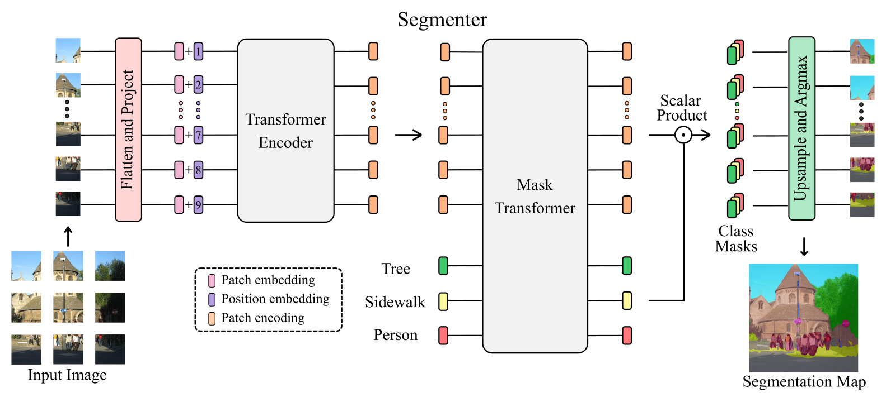

# Segmenter: Transformer for Semantic Segmentation

⚠️ Excerpt from the README of [Segmenter GitHub repository](https://github.com/rstrudel/segmenter/)



[Segmenter: Transformer for Semantic Segmentation](https://arxiv.org/abs/2105.05633)
by Robin Strudel*, Ricardo Garcia*, Ivan Laptev and Cordelia Schmid, ICCV 2021.

*Equal Contribution

🔥 **Segmenter is now available on [MMSegmentation](https://github.com/open-mmlab/mmsegmentation/tree/master/configs/segmenter).**

## Model Zoo
We release models with a Vision Transformer backbone initialized from the [improved ViT](https://arxiv.org/abs/2106.10270) models.

### ADE20K

Segmenter models with ViT backbone:
<table>
  <tr>
    <th>Name</th>
    <th>mIoU (SS/MS)</th>
    <th># params</th>
    <th>Resolution</th>
    <th>FPS</th>
    <th colspan="3">Download</th>
  </tr>
<tr>
    <td>Seg-T-Mask/16</td>
    <td>38.1 / 38.8</td>
    <td>7M</td>
    <td>512x512</td>
    <td>52.4</td>
    <td><a href="https://www.rocq.inria.fr/cluster-willow/rstrudel/segmenter/checkpoints/ade20k/seg_tiny_mask/checkpoint.pth">model</a></td>
    <td><a href="https://www.rocq.inria.fr/cluster-willow/rstrudel/segmenter/checkpoints/ade20k/seg_tiny_mask/variant.yml">config</a></td>
    <td><a href="https://www.rocq.inria.fr/cluster-willow/rstrudel/segmenter/checkpoints/ade20k/seg_tiny_mask/log.txt">log</a></td>
  </tr>
<tr>
    <td>Seg-S-Mask/16</td>
    <td>45.3 / 46.9</td>
    <td>27M</td>
    <td>512x512</td>
    <td>34.8</td>
    <td><a href="https://www.rocq.inria.fr/cluster-willow/rstrudel/segmenter/checkpoints/ade20k/seg_small_mask/checkpoint.pth">model</a></td>
    <td><a href="https://www.rocq.inria.fr/cluster-willow/rstrudel/segmenter/checkpoints/ade20k/seg_small_mask/variant.yml">config</a></td>
    <td><a href="https://www.rocq.inria.fr/cluster-willow/rstrudel/segmenter/checkpoints/ade20k/seg_small_mask/log.txt">log</a></td>
  </tr>
<tr>
    <td>Seg-B-Mask/16</td>
    <td>48.5 / 50.0</td>
    <td>106M</td>
    <td>512x512</td>
    <td>24.1</td>
    <td><a href="https://www.rocq.inria.fr/cluster-willow/rstrudel/segmenter/checkpoints/ade20k/seg_base_mask/checkpoint.pth">model</a></td>
    <td><a href="https://www.rocq.inria.fr/cluster-willow/rstrudel/segmenter/checkpoints/ade20k/seg_base_mask/variant.yml">config</a></td>
    <td><a href="https://www.rocq.inria.fr/cluster-willow/rstrudel/segmenter/checkpoints/ade20k/seg_base_mask/log.txt">log</a></td>
  </tr>
<tr>
    <td>Seg-B/8</td>
    <td>49.5 / 50.5</td>
    <td>89M</td>
    <td>512x512</td>
    <td>4.2</td>
    <td><a href="https://www.rocq.inria.fr/cluster-willow/rstrudel/segmenter/checkpoints/ade20k/seg_base_patch8/checkpoint.pth">model</a></td>
    <td><a href="https://www.rocq.inria.fr/cluster-willow/rstrudel/segmenter/checkpoints/ade20k/seg_base_patch8/variant.yml">config</a></td>
    <td><a href="https://www.rocq.inria.fr/cluster-willow/rstrudel/segmenter/checkpoints/ade20k/seg_base_patch8/log.txt">log</a></td>
  </tr>
<tr>
    <td>Seg-L-Mask/16</td>
    <td>51.8 / 53.6</td>
    <td>334M</td>
    <td>640x640</td>
    <td>-</td>
    <td><a href="https://www.rocq.inria.fr/cluster-willow/rstrudel/segmenter/checkpoints/ade20k/seg_large_mask_640/checkpoint.pth">model</a></td>
    <td><a href="https://www.rocq.inria.fr/cluster-willow/rstrudel/segmenter/checkpoints/ade20k/seg_large_mask_640/variant.yml">config</a></td>
    <td><a href="https://www.rocq.inria.fr/cluster-willow/rstrudel/segmenter/checkpoints/ade20k/seg_large_mask_640/log.txt">log</a></td>
  </tr>
</table>

Segmenter models with DeiT backbone:
<table>
  <tr>
    <th>Name</th>
    <th>mIoU (SS/MS)</th>
    <th># params</th>
    <th>Resolution</th>
    <th>FPS</th>
    <th colspan="3">Download</th>
  </tr>
<tr>
    <td>Seg-B<span>&#8224;</span>/16</td>
    <td>47.1 / 48.1</td>
    <td>87M</td>
    <td>512x512</td>
    <td>27.3</td>
    <td><a href="https://www.rocq.inria.fr/cluster-willow/rstrudel/segmenter/checkpoints/ade20k/seg_base_deit_linear/checkpoint.pth">model</a></td>
    <td><a href="https://www.rocq.inria.fr/cluster-willow/rstrudel/segmenter/checkpoints/ade20k/seg_base_deit_linear/variant.yml">config</a></td>
    <td><a href="https://www.rocq.inria.fr/cluster-willow/rstrudel/segmenter/checkpoints/ade20k/seg_base_deit_linear/log.txt">log</a></td>
  </tr>
<tr>
    <td>Seg-B<span>&#8224;</span>-Mask/16</td>
    <td>48.7 / 50.1</td>
    <td>106M</td>
    <td>512x512</td>
    <td>24.1</td>
    <td><a href="https://www.rocq.inria.fr/cluster-willow/rstrudel/segmenter/checkpoints/ade20k/seg_base_deit_mask/checkpoint.pth">model</a></td>
    <td><a href="https://www.rocq.inria.fr/cluster-willow/rstrudel/segmenter/checkpoints/ade20k/seg_base_deit_mask/variant.yml">config</a></td>
    <td><a href="https://www.rocq.inria.fr/cluster-willow/rstrudel/segmenter/checkpoints/ade20k/seg_base_deit_mask/log.txt">log</a></td>

  </tr>
</table>

### Pascal Context
<table>
  <tr>
    <th>Name</th>
    <th>mIoU (SS/MS)</th>
    <th># params</th>
    <th>Resolution</th>
    <th>FPS</th>
    <th colspan="3">Download</th>
  </tr>
<tr>
    <td>Seg-L-Mask/16</td>
    <td>58.1 / 59.0</td>
    <td>334M</td>
    <td>480x480</td>
    <td>-</td>
    <td><a href="https://www.rocq.inria.fr/cluster-willow/rstrudel/segmenter/checkpoints/pascal_context/seg_large_mask/checkpoint.pth">model</a></td>
    <td><a href="https://www.rocq.inria.fr/cluster-willow/rstrudel/segmenter/checkpoints/pascal_context/seg_large_mask/variant.yml">config</a></td>
    <td><a href="https://www.rocq.inria.fr/cluster-willow/rstrudel/segmenter/checkpoints/pascal_context/seg_large_mask/log.txt">log</a></td>
  </tr>
</table>

### Cityscapes
<table>
  <tr>
    <th>Name</th>
    <th>mIoU (SS/MS)</th>
    <th># params</th>
    <th>Resolution</th>
    <th>FPS</th>
    <th colspan="3">Download</th>
  </tr>
<tr>
    <td>Seg-L-Mask/16</td>
    <td>79.1 / 81.3</td>
    <td>322M</td>
    <td>768x768</td>
    <td>-</td>
    <td><a href="https://www.rocq.inria.fr/cluster-willow/rstrudel/segmenter/checkpoints/cityscapes/seg_large_mask/checkpoint.pth">model</a></td>
    <td><a href="https://www.rocq.inria.fr/cluster-willow/rstrudel/segmenter/checkpoints/cityscapes/seg_large_mask/variant.yml">config</a></td>
    <td><a href="https://www.rocq.inria.fr/cluster-willow/rstrudel/segmenter/checkpoints/cityscapes/seg_large_mask/log.txt">log</a></td>
  </tr>
</table>

## Video Segmentation

Zero shot video segmentation on [DAVIS](https://davischallenge.org/) video dataset with Seg-B-Mask/16 model trained on [ADE20K](https://groups.csail.mit.edu/vision/datasets/ADE20K/).

<p align="middle">
  
  
</p>
<p align="middle">
  
  
</p>

## BibTex

```
@article{strudel2021,
  title={Segmenter: Transformer for Semantic Segmentation},
  author={Strudel, Robin and Garcia, Ricardo and Laptev, Ivan and Schmid, Cordelia},
  journal={arXiv preprint arXiv:2105.05633},
  year={2021}
}
```


## Acknowledgements

The Vision Transformer code is based on [timm](https://github.com/rwightman/pytorch-image-models) library and the semantic segmentation training and evaluation pipeline 
is using [mmsegmentation](https://github.com/open-mmlab/mmsegmentation).